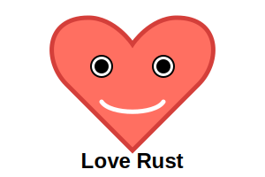

# Rust Practice Hub

This repository contains various Rust code examples to demonstrate different concepts and features in the Rust programming language.

|  |
|:--:|
| `loveRust.rs` |

## Why?

I created these examples for the sheer fun of exploring Rust and learning more about this excellent programming language.

Feel free to use these examples to learn Rust or as a reference for your own projects. If you find any issues or have ideas for improvement, I'd be happy to receive contributions and feedback.

## How to Contribute

Contributions are welcome! If you have any interesting Rust examples, bug fixes, or enhancements, feel free to submit a pull request. Let's collaborate and build a collection of useful and educational Rust examples together.

## Usage

Each directory contains an example showcasing a specific topic in Rust. Click on the links to navigate to the respective examples and learn more about them.

# Examples without category

- [Borrowing](./borrowing/): Demonstrates borrowing and ownership concepts in Rust.
- [Borrowing various other example](./borrowing-various-aspects/): Demonstrates borrowing and ownership concepts.
- [Borrowing Ownership Moves](./borrowing_ownership_moves): Illustrates the movement of ownership between variables in Rust.
- [Closures and Anonymous Functions](./closures_anonymous_functions): Shows the usage of closures and anonymous functions in Rust.
- [No Std Call Libc Functions](./no_std_call_libc_functions): Uses libc functions in a `no_std` environment.
- [Raw Pointers](./raw_pointers): Demonstrates the usage of raw pointers in Rust.
- [Standard C Math Example](./standard_c_math_example): Performs math calculations using standard C math functions in a `no_std` environment.
- [Threads](./threads): Shows how to use threads for concurrent execution.
- [Tic Tac Toe console game](./tic-tac-toe): Simple Tic Tac Toe game in Rust.
- [Test minifb - Human Face mouse follower](./test-minifb): Abstract human face follow the mouse movment in a window.

# Design patterns
- [Factory Pattern](./design-patterns/factory-pattern/): Shows how to use factory design pattern in Rust.
- [Abstract Factory Pattern](./design-patterns/abstract-factory-pattern/): Shows how to use abstract factory design pattern in Rust.
- [Command Pattern](./design-patterns/command-pattern/): Shows how to use factory command pattern in Rust. It demonstartes it by a simple implementation of Mars Rover kata.
- [Builder Pattern](./design-patterns/builder-pattern/): Shows how to use a builder design pattern in Rust.

# Generics
- [Simple example](./generics/generic_storage/): Shows how to use generics in Rust.

# Math examples
- [Basic Calorie Calculator](./math/bmr-calculator/): It shows how math operators can be used in Rust.
- [Imperative & Declarative paradigm - Fibonacci algoritmh](./math/fibonacci/): Imperative & Declarative paradigm example.

# Generics
- [Simple example](./generics/generic_storage/): Shows how to use generics in Rust.

# Data processing
- [CSV](./data-processing/csv-processing/): Basic implementation of CSV processing and a data pipeline.

# Data structures
- [Heap](./data-structures/heap/): Basic implementation of heap.
- [Hast tables & memory managmenet](./data-structures/hash-map-memory-allcoation/) Basic implementation of hash table and show its memory usage.

# Functional programming
- [Functional Programming short docs](./functional_programming): Couple of words about functional programming paradigm.
- [Concept of Pure Functions](./functional_programming/pure-function-basic): Filtering Even Numbers example.
- [Immutability](./functional_programming/immutability//): Couple examples of immutability in Rust.
- [Higher Order Functions](./functional_programming/higher-oreder-functions/): Couple examples for Higher Order Functions in Rust.
- [Function composition](./functional_programming/function-composition/): Couple examples for Function composition in Rust.

# Network
- [Simple HTTP server](./network/basic-http-server/): It shows how to create a very simple HTTP server in Rust without using external library.

# Streams
- [Simple streaming](./streams/sensor_stream/): It shows how to create a very simple HTTP sensor data writing and reading solution.

Each directory contains an example showcasing a specific topic in Rust. Click on the links to navigate to the respective examples and learn more about them.

